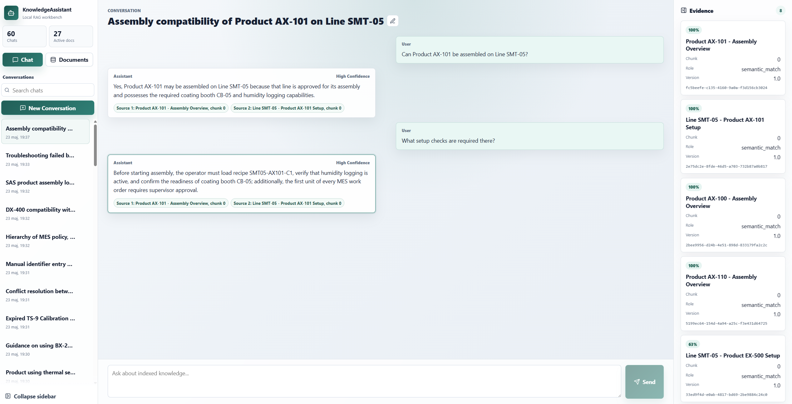
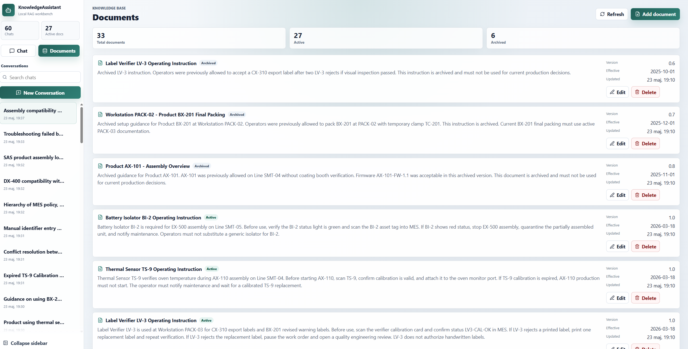
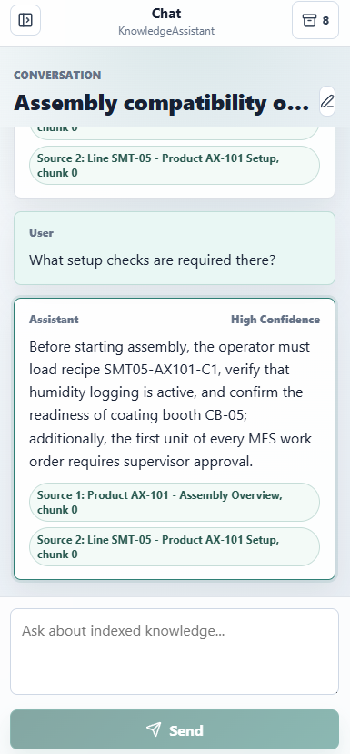
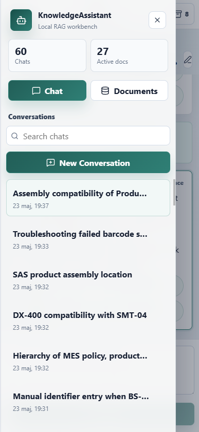
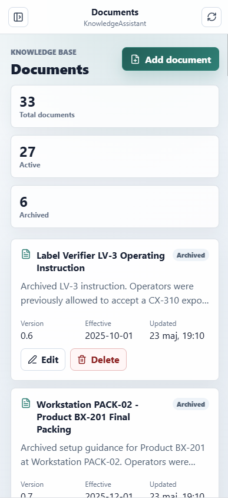

# KnowledgeAssistant

KnowledgeAssistant is a local-first documentation chatbot for internal procedures,
policies, regulations, and operational knowledge.

It stores documents, chunks and embeds their content, retrieves relevant evidence with
hybrid search, and generates grounded answers with source references. The application
is built as a FastAPI backend, PostgreSQL/pgvector database, and React frontend.

## What It Does

- Answers natural-language questions using internal documentation.
- Stores documents with status, version, effective date, metadata, and parent document links.
- Archives older active documents with the same title when a newer version is created.
- Indexes document chunks with embeddings for semantic retrieval.
- Uses hybrid retrieval: vector similarity plus PostgreSQL full-text keyword search.
- Expands retrieval with parent documents for basic document hierarchy support.
- Returns answers with cited chunk IDs and source metadata.
- Supports persistent chatbot conversations.
- Provides a frontend for chat and document management.

## Screenshots

### Chat Workspace

The chat view keeps conversation history, grounded answers, confidence, cited
chunks, and source evidence visible in one workspace.



### Document Management

The document view shows active and archived knowledge base entries with version,
effective date, status, and edit/delete actions.



### Mobile Experience

The mobile layout keeps chat usable on narrow screens and moves navigation into
a drawer.

| Chat | Navigation | Documents |
| --- | --- | --- |
|  |  |  |

## Business Domain

The current demo business domain is MES/manufacturing documentation: products,
production places, workstations, cells, equipment instructions, setup rules,
quality requirements, and operational exceptions.

The main domain reference is:

- [Business and domain summary](docs/business-domain-summary.md)

Use that document when seeding data, testing chatbot behavior, or handing the
project to another AI agent. It explains what the application is building, what
users can do, what domain data should exist, and which chatbot scenarios should
be validated.

## Current Architecture

```text
React frontend
  -> FastAPI API
    -> document CRUD and indexing
    -> conversation state
    -> hybrid retrieval
    -> answer generation
  -> PostgreSQL + pgvector
  -> OpenAI-compatible local model endpoint, for example LM Studio
```

## Tech Stack

- Python 3.11
- FastAPI
- SQLAlchemy async ORM
- Alembic
- PostgreSQL 16 with pgvector
- OpenAI Python SDK against an OpenAI-compatible endpoint
- React 19 + Vite + TypeScript
- Docker Compose
- pytest, ruff, testcontainers

## Frontend Structure

The frontend is organized by API access, shared components, feature areas,
layout components, utilities, and styles:

```text
frontend/src/
  api/          API client and shared API types
  components/   Reusable UI components
  features/     Feature-specific UI such as chat and documents
  layout/       App shell, sidebar, mobile app bar, and evidence panel
  lib/          Shared utilities
  styles/       Global stylesheet
  App.tsx       Application state and orchestration
  main.tsx      React entry point
```

## Quick Start With Docker

Prerequisites:

- Docker Desktop
- An OpenAI-compatible local model server, such as LM Studio
- A chat model and embedding model loaded in that server

Start the application:

```powershell
docker compose up -d --build
```

Apply migrations:

```powershell
docker compose exec api alembic upgrade head
```

Open:

- Frontend: [http://localhost:5173](http://localhost:5173)
- API docs: [http://localhost:8000/docs](http://localhost:8000/docs)
- Health: [http://localhost:8000/health](http://localhost:8000/health)

## Configuration

The Docker setup reads `.env.example` by default.

Important values:

```env
OPENAI_BASE_URL=http://host.docker.internal:1234/v1
OPENAI_API_KEY=lm-studio
LLM_MODEL=google/gemma-4-e4b
EMBEDDING_MODEL=text-embedding-embeddinggemma-300m-qat
EMBEDDING_DIMENSION=768
TOP_K=5
RETRIEVAL_MIN_SIMILARITY=0.3
```

For LM Studio, keep the base URL as:

```env
OPENAI_BASE_URL=http://host.docker.internal:1234/v1
```

The embedding dimension must match the embedding model. If the model returns vectors
with a different dimension than `EMBEDDING_DIMENSION`, indexing and retrieval will fail.

## API Overview

Documents:

- `POST /documents`
- `GET /documents`
- `GET /documents/{document_id}`
- `PATCH /documents/{document_id}`
- `DELETE /documents/{document_id}`
- `POST /documents/{document_id}/reindex`

Chat and retrieval:

- `POST /chat`
- `POST /chat/retrieve`

Conversations:

- `POST /conversations`
- `GET /conversations`
- `GET /conversations/{conversation_id}`
- `GET /conversations/{conversation_id}/messages`
- `POST /conversations/{conversation_id}/messages`

Query logs:

- `GET /queries`

## Development

Install dependencies with `uv`:

```powershell
uv sync --extra dev
```

Run tests:

```powershell
uv run --extra dev pytest
```

Run lint:

```powershell
uv run --extra dev ruff check app alembic tests
```

Compile-check Python files:

```powershell
uv run python -m compileall app alembic main.py scripts
```

Run the backend locally:

```powershell
uv run uvicorn app.main:app --reload
```

Run the frontend locally:

```powershell
cd frontend
npm install
npm run dev
```

## Retrieval Flow

At a high level:

```text
question
  -> embedding
  -> vector search
  -> keyword full-text search
  -> score merge
  -> parent document expansion
  -> answer prompt
  -> JSON answer validation
```

Returned sources include a `source_role`, currently one of:

- `semantic_match`
- `keyword_match`
- `hybrid_match`
- `hierarchy_parent`

## Answer Safety

The assistant is designed to avoid answering beyond available documentation.

Current safeguards:

- Retrieved sources are passed separately from conversation history.
- Document answers must cite valid retrieved chunk IDs.
- Invalid model output is rejected.
- Insufficient evidence is normalized to a standard response.
- Archived documents are excluded from retrieval by default.
- Parent documents are included when relevant child documents are retrieved.
